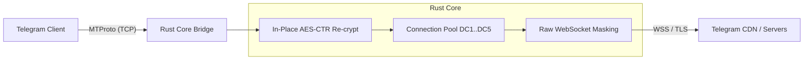

# ⚡ Telegram WebSocket Proxy (Rust + Tauri v2)

[](https://www.rust-lang.org/)
[](https://tauri.app/)
[](https://vuejs.org/)
[](https://tailwindcss.com/)
[](LICENSE)

Высокопроизводительный MTProto-прокси для Telegram с маскировкой трафика под стандартный HTTPS/WSS (WebSocket) поверх TLS. Разработан для обхода блокировок DPI и провайдерских ограничений с минимальной задержкой и околонулевым оверхедом памяти.

---

## ✨ Особенности

- 🚀 **Сверхбыстрое ядро на Rust & Tokio**:
  - **In-place Zero-Copy Re-encryption**: Перешифровка MTProto трафика (AES-CTR) происходит прямо в сетевом буфере без промежуточных аллокаций памяти и очередей каналов.
  - **Оптимизированный WebSocket Handshake**: Вычитывание ответа CDN блоками по 1 КБ с сохранением фреймов вместо побайтового опроса.
  - **Пул горячих соединений (Connection Pool)**: Предварительный прогрев сокетов к датацентрам Telegram (DC2, DC4) и мгновенное автопополнение пула в фоновом режиме.
- 🎨 **Современный GUI (Tauri v2 + Vue 3 + Tailwind CSS v4)**:
  - Глубокая тёмная палитра с неоновыми акцентами и кастомными числовыми степперами.
  - Мониторинг телеметрии в реальном времени: входящий/исходящий трафик, активные сокеты и статус моста.
  - Бесшовное автосохранение конфигурации с плавающими уведомлениями.
  - Быстрое копирование прокси-ссылки и открытие прямо в Telegram (`tg://proxy?...`).
- 🛡️ **Обход DPI**:
  - Маскировка трафика под легитимный HTTPS трафик к доменам Telegram CDN.
  - Поддержка фрагментации пакетов (Splitter) для обхода эвристик цензуры.
- 📦 **Системная интеграция**:
  - Работа в системном трее, поддержка автозапуска при старте ОС, кастомный заголовок окна.

---

## 🛠 Архитектура



---

## 📥 Установка и запуск

### Готовые релизы
Перейдите на страницу **[Releases](https://github.com/rxzsu/tg-ws-rust/releases)** и скачайте сборку для вашей ОС:
- **Windows**: `.msi` инсталлятор или `.exe`
- **Linux**: `.AppImage` или `.deb`
- **macOS**: `.dmg`

### Сборка из исходников

Требования:
- [Bun](https://bun.sh/) (рекомендуется) или Node.js 20+
- [Rust](https://rustup.rs/) (версия 1.85+ с поддержкой редакции 2024)

1. Клонируйте репозиторий:
   ```bash
   git clone https://github.com/rxzsu/tg-ws-rust.git
   cd tg-ws-rust
   ```

2. Установите зависимости фронтенда:
   ```bash
   bun install
   ```

3. Запустите в режиме разработки:
   ```bash
   bun run tauri dev
   ```

4. Соберите релизный бинарник:
   ```bash
   bun run tauri build
   ```

---

## ⚙️ Настройки

| Параметр | По умолчанию | Описание |
| :--- | :--- | :--- |
| **Порт** | `8443` | Локальный порт для подключения Telegram клиента |
| **Секрет** | `713eb5...` | Секретный ключ MTProto прокси |
| **Пул соединений** | `10` | Количество готовых предварительно открытых WebSocket сессий |
| **Размер буфера** | `65536` | Размер буфера передачи данных (в байтах) |
| **Сплиттер** | `32` | Размер фрагментации первого пакета для обхода DPI |
| **Автозапуск** | `Выкл` | Автоматический старт при запуске системы |

---

## 📄 Лицензия

Проект распространяется под лицензией [MIT](LICENSE).
